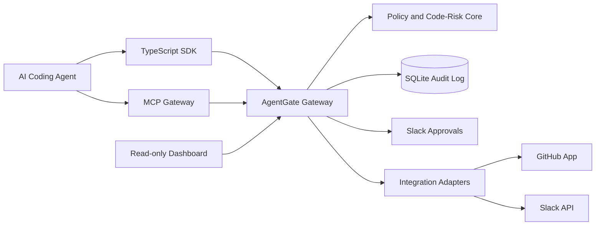

# AgentGate Architecture

AgentGate sits between an AI coding agent and GitHub repository-changing actions. Agents call the SDK or MCP gateway before creating, updating, or merging a pull request. AgentGate evaluates policy, changed-file risk, diff risk, and approval state before allowing the GitHub action to proceed.

The first version is local-first. GitHub App callbacks and Slack interactivity use a tunnel URL, while SQLite keeps audit data and approval state durable between runs. Notion and internal API workflows are post-MVP extensions; the MVP wedge is repository-change approval.
