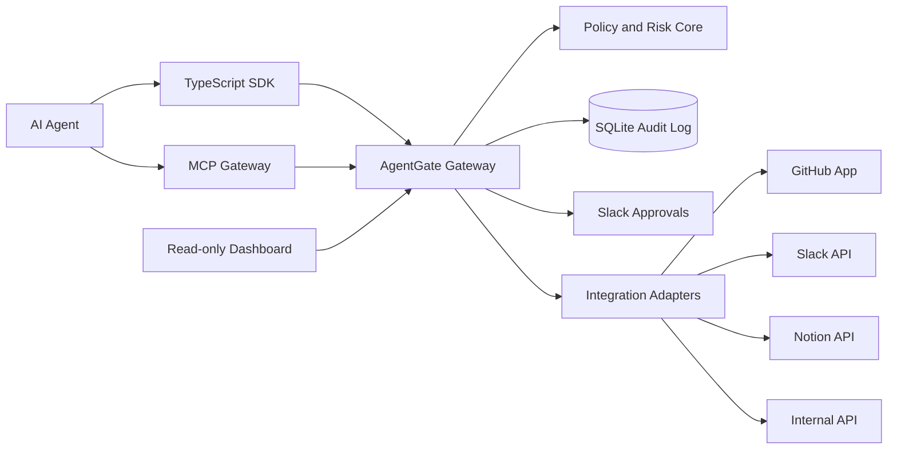

# AgentGate Architecture

AgentGate sits between an agent and every external tool action. Agents call the SDK or MCP gateway, AgentGate evaluates policy and risk, and only allowed actions reach GitHub, Slack, Notion, or the internal API.

The first version is local-first. OAuth callbacks and Slack interactivity use a tunnel URL, while SQLite keeps audit data and approval state durable between runs.

