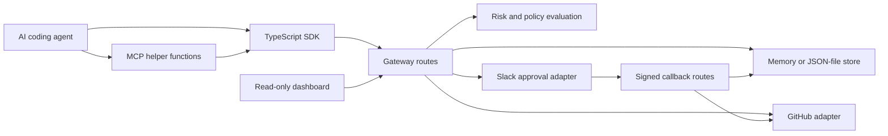

# AgentGate architecture

The gateway receives an action and caller-supplied change evidence. It classifies risk, evaluates its embedded policy and records an audit event. `/v1/actions/authorize` records a decision only; `/v1/actions/execute` also orchestrates fixture or real adapters.

```mermaid
flowchart LR
  Agent[AI coding agent] --> SDK[TypeScript SDK]
  Agent --> MCP[MCP helper functions]
  SDK --> Gateway[Gateway routes]
  MCP --> SDK
  Gateway --> Core[Risk and policy evaluation]
  Gateway --> Store[Memory or JSON-file store]
  Gateway --> GitHub[GitHub adapter]
  Gateway --> Slack[Slack approval adapter]
  Slack --> Callback[Signed callback routes]
  Callback --> Store
  Callback --> GitHub
  Dashboard[Read-only dashboard] --> Gateway
```

## Decision flow

1. Classify the supplied `changedFiles`, `deletedFiles` and `diffText`.
2. Evaluate the embedded policy against action, agent ID, integration and the risk label.
3. Record the decision and risk reasons.
4. For a block, return HTTP 403 without calling either integration adapter. For approval-required, notify Slack, store a pending action and return HTTP 202 without executing GitHub. For an allow, call the GitHub adapter.
5. A valid approval callback resolves the stored request; approval executes its stored action, while denial does not. Approval outcome and execution success are separate: integration failure may follow a granted approval.
6. Successful create/update calls may publish a commit status if the stored request includes `github.headSha`.

## Storage and configuration

The default `MemoryStore` is process-local and resets on restart. `AGENTGATE_STORE_PATH` selects `JsonFileStore`, which writes JSON through a temporary file and rename. SQLite is not implemented. Neither store provides transactional coordination across concurrent requests/processes.

The gateway policy is currently a constant in [`routes.ts`](../apps/gateway/src/routes.ts). The YAML parser and example policy are separate building blocks; the server does not load the YAML file.

[`createGatewayAdapters`](../apps/gateway/src/adapters/gatewayAdapters.ts) selects fixture or opt-in real adapters. The self-contained [fixture demo](fixture-demo.md) passes its adapters and memory store explicitly and never starts an HTTP listener.

## Integration scope

The real GitHub adapter opens PRs from existing refs, edits PR metadata and merges PRs. Updating metadata does not change the branch's code. The MCP package provides tool and JSON-RPC handlers; transport hosting and client registration remain the caller's responsibility. GitHub webhook processing records signed events and delivery IDs for audit correlation; it does not independently calculate the diff used for authorisation.

See [security boundary](security-boundary.md) for why this flow alone does not establish complete mediation or immutable evidence binding, and [validation](validation.md) for the distinction between fixture/mock checks and a live integration test.
